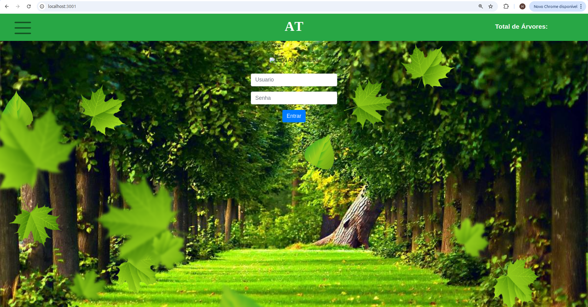
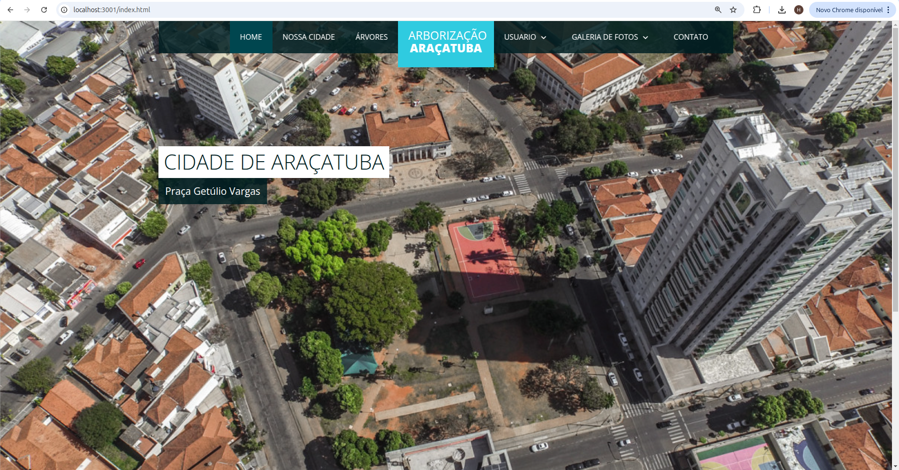
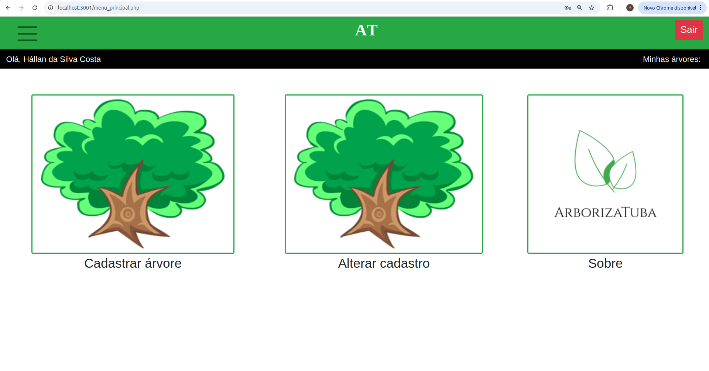
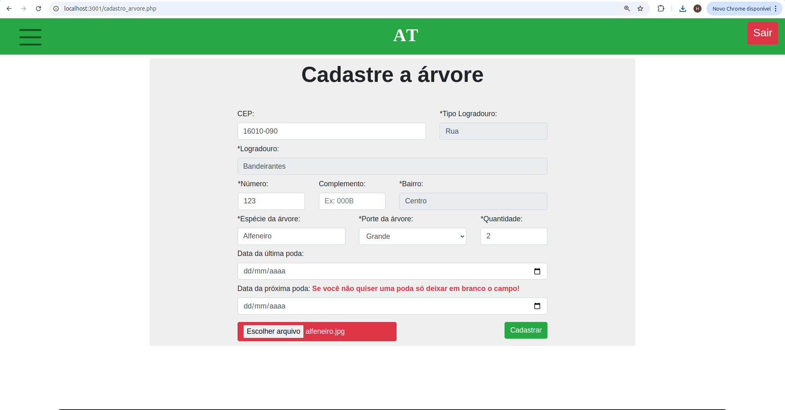
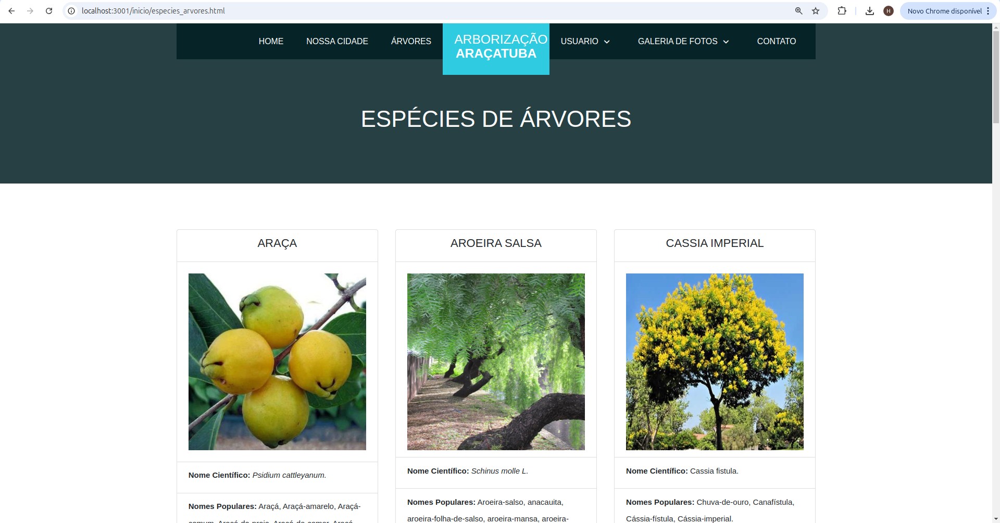

# Arborizatuba

Sistema de arborização para controle de árvores e poda da cidade

## 🚀 Como Rodar o Projeto

```bash
docker compose up -d
```

Acesse: **http://localhost:3001**

## 👤 Credenciais de Acesso

- **Usuário:** hallan
- **Senha:** hallan123

- **Usuário:** hallex
- **Senha:** hallex123

## 📸 Screenshots

### Tela de Login


### Página Principal


### Menu Principal


### Cadastrar Árvore


### Espécies de Árvore


## 📝 Observações

#### P.S.: Peço para que não troque a senha do E-mail. Obgdo!.

#### Att: Hállan e Hállex


## 👥 Autores

|Autor|Autor|
|--|--|
|[<br><sub>@HallanCosta</sub>](https://github.com/hallancosta)|[<br><sub>@HallexCosta</sub>](https://github.com/hallexcosta)|
